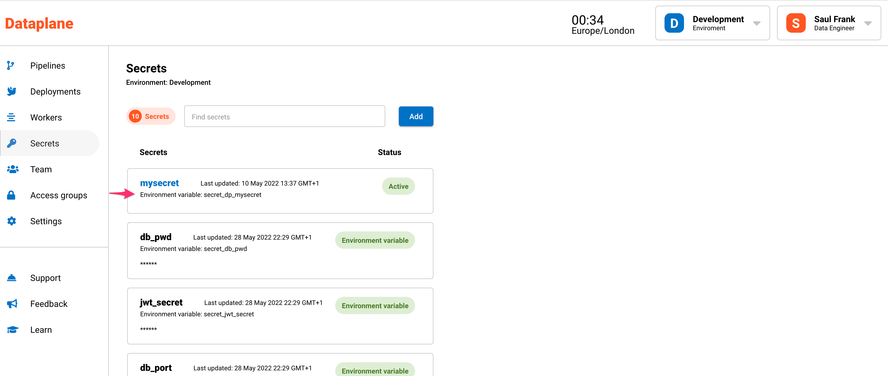

Data teams require secure access to data resources such as databases and cloud storage. To keep these reseources secure, data teams shouldn't share passwords or secrets. Equally, data teams shouldn't have the ability to print out the password or secret in the console log - this happens often and can cause serious security risks. 

Dataplane is designed to securely distribute secrets without actually revealing the secret.

In the background, secrets are loaded into the workers using environment variables. These environment variables are used in the code to reference the secret. If anyone tries to print out the secret, it will be redacted from the logs. 
 
 Below is a step by step guide on how to use secrets in Dataplane. 
<br />


### Adding secrets

There are two ways in which you can add secrets to Dataplane. 

* Using Dataplane's dashboard under Secrets
* Using environment variables

<br />

#### Adding secrets using Dataplane's dashboard

1. Click on Secrets in the menu.
2. Click on the Add button, you will be navigated to a screen to add a secret.
3. Give the secret a name. The name cannot accept spaces, use an underscore instead. A secret name cannot be used twice, use unique names for each of your secrets.
4. Give the secret a description (optional)
5. Enter the secret or password in the Secret field.


#### Adding secrets using environment variables

Dataplane detects secrets by looking for **secret_** as a prefix in the environment variable key. You should only add these secrets to the worker nodes.

Here is an example from a Kubernetes yaml file:
```yaml
- name: secret_db_pwd 
    valueFrom:
    secretKeyRef:
        name: dataplane-demo-secret
        key: secret_db_pwd
```

:::danger Root access to worker nodes
As with any server environment, environment variables can be printed out by anyone who has root access to the worker nodes, for example, using SSH or kubectl exec. As part of your security policy or best security practices, you should only provide this type of privilged access to trusted team members. 
:::

<br />

### Adding secrets to workers

Secrets added by environment variables are added directly to the worker. 

Secrets added on the dashboard need to be assigned to workers using these steps:

1. Click on the secret.
2. In the drop down menu under Worker Groups, select the worker group to assign the secret to.
3. Click the Add button.


<br />

### Using a secret in a data pipeline

Simply reference the environment variable in your code. 

Here is an example in Python.
```python
import os

mysecret = os.getenv("secret_dp_mysecret")
```

The environment variable is shown underneath the secret on the secrets page. 




